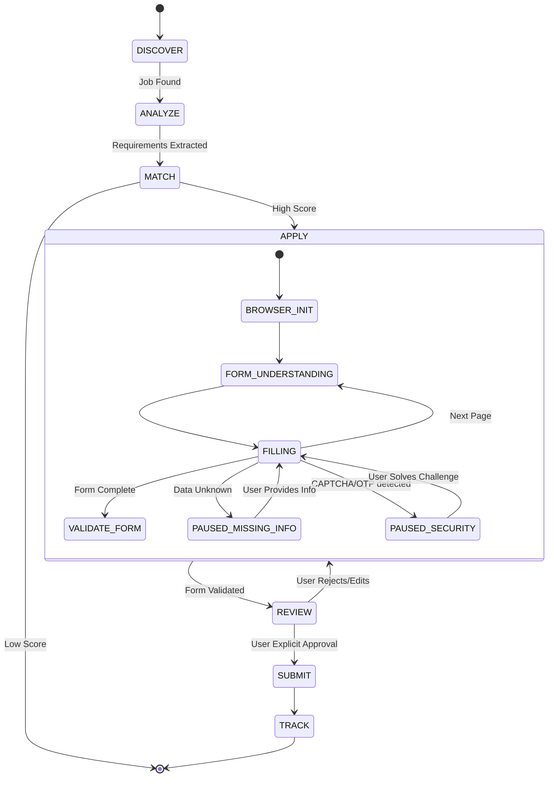

# Agent Architecture

## 1. Orchestration Model
The agent architecture is stateful and orchestrated via LangGraph. It is NOT an unconstrained autonomous loop. It follows a rigid state machine where transitions between states require specific validations, and terminal actions require human approval.

## 2. The Application State Machine
The agent workflow follows this lifecycle:

## 3. Enforcement of Principles

### Principle 1: LLM as a Reasoner
The LLM node in the LangGraph does not output API calls to Playwright. It outputs an intent (e.g., `ActionIntent(type="FILL_FIELD", target="email_input", source_memory_id=123)`). The orchestrator resolves the memory ID, validates the policy, and translates it to a browser action.

### Principle 3: Anti-Hallucination
During the `FILLING` state, if the LLM cannot find a mapping between a form field and a `CONFIRMED` MemoryFact in the vector database, it transitions the state to `PAUSED_MISSING_INFO`.

### Principle 4: Explicit Human Control
The transition from `REVIEW` to `SUBMIT` cannot be executed by the LLM. It is a strictly typed API endpoint (`POST /applications/{id}/submit`) that must be invoked by the human user via the Next.js frontend.
