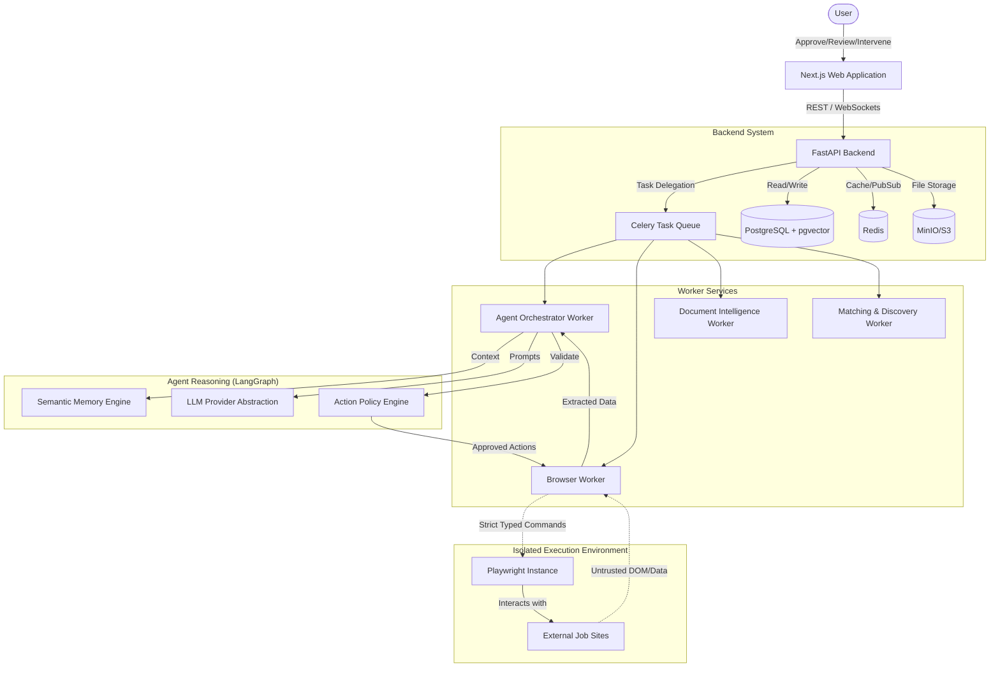

# System Architecture

## 1. Executive Architecture Overview

The AI Job Application Agent is a distributed, multi-service system designed to autonomously discover, analyze, and apply to jobs on behalf of a user. To ensure safety, security, and accuracy, the system enforces a strict boundary between reasoning (LLM) and execution (Browser). The LLM cannot execute arbitrary browser commands; it must issue typed, structured requests that pass through a policy validation engine before being executed by Playwright.

The system requires explicit human approval before submitting any application, ensuring that the candidate retains full control over the process.

## 2. Conceptual Architecture

## 3. Core Architectural Principles

1.  **LLM is a Reasoner, Not the Source of Truth:** The LLM evaluates state and suggests typed actions. It does not directly control the environment.
2.  **External Websites are Untrusted:** Data from job sites is treated as potentially hostile and is strictly sanitized. Prompt injection from external sources must not result in arbitrary execution.
3.  **Never Hallucinate Candidate Information:** The system only uses information explicitly approved by the user (stored in the provenanced memory). It will halt and ask the user rather than guess.
4.  **Explicit Human Control Over Submission:** The system may fill out the application autonomously, but final submission is gated by human approval.
5.  **CAPTCHA/OTP/2FA Must Not Be Bypassed:** Encountering security challenges pauses the process for human intervention.
6.  **Memory is Evidence-Based:** Every piece of candidate data has a provenance trail indicating when and how the user approved it.
7.  **Browser Actions Must Be Typed:** Browser interactions are constrained to a predefined set of typed actions (e.g., `Click(element_id)`, `Fill(element_id, value)`), not arbitrary JavaScript evaluation.
