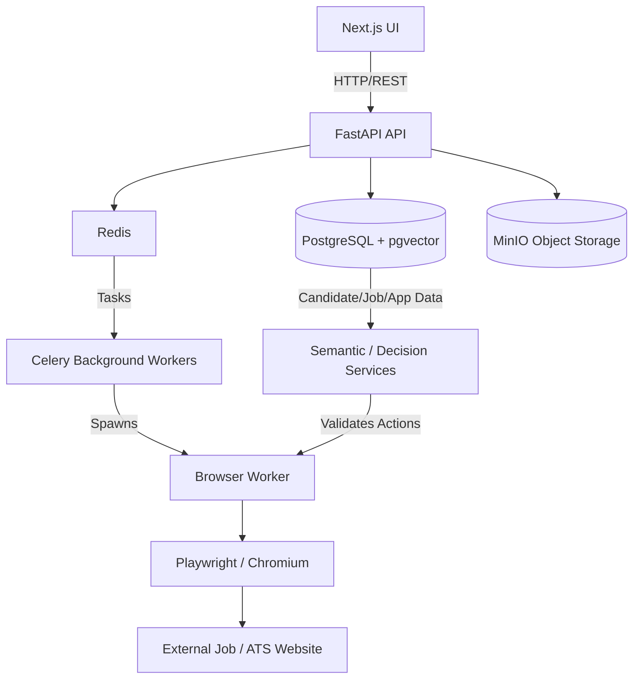
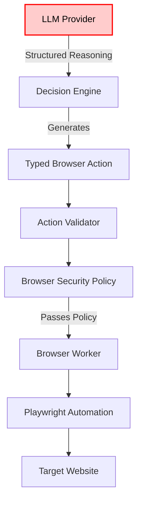

# System Architecture

## System Overview

## AI Decision Pipeline

Note: The LLM is NOT the source of truth and cannot directly execute arbitrary browser actions. It produces reasoning which must pass strict, deterministic action validation.

