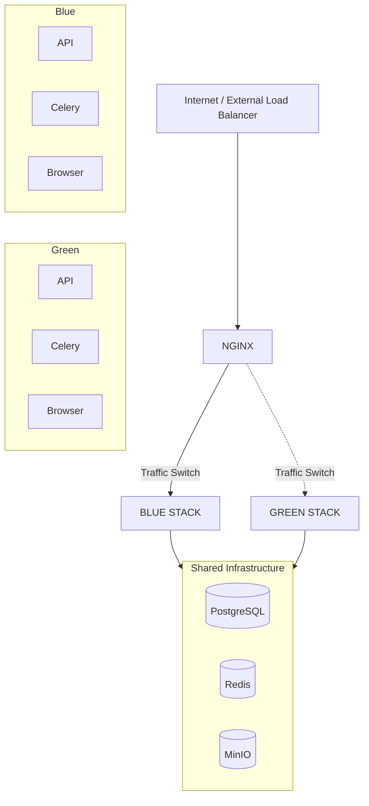
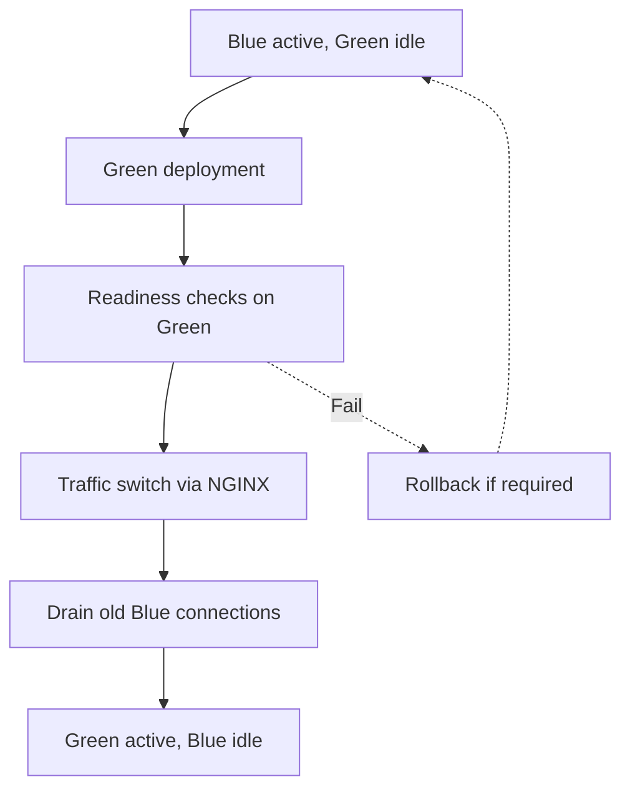

# Production Deployment Architecture

## Deployment Topology

```mermaid
flowchart TD
    Internet[Internet / External Load Balancer] --> NGINX[NGINX]
    
    NGINX -->|Traffic Switch| Blue[BLUE STACK]
    NGINX -.->|Traffic Switch| Green[GREEN STACK]
    
    subgraph BlueStack [Blue]
        B_API[API]
        B_Cel[Celery]
        B_BW[Browser]
    end
    
    subgraph GreenStack [Green]
        G_API[API]
        G_Cel[Celery]
        G_BW[Browser]
    end
    
    Blue --> Shared
    Green --> Shared
    
    subgraph Shared [Shared Infrastructure]
        PG[(PostgreSQL)]
        Red[(Redis)]
        MinIO[(MinIO)]
    end
    
    BlueStack ~~~ GreenStack
```

## Zero-Downtime Deployment Flow

```mermaid
flowchart TD
    Start[Blue active, Green idle] --> Deploy[Green deployment]
    Deploy --> Checks[Readiness checks on Green]
    Checks --> Switch[Traffic switch via NGINX]
    Switch --> Drain[Drain old Blue connections]
    Drain --> End[Green active, Blue idle]
    
    Checks -.->|Fail| Rollback[Rollback if required]
    Rollback -.-> Start
```
