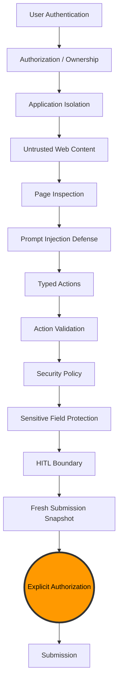
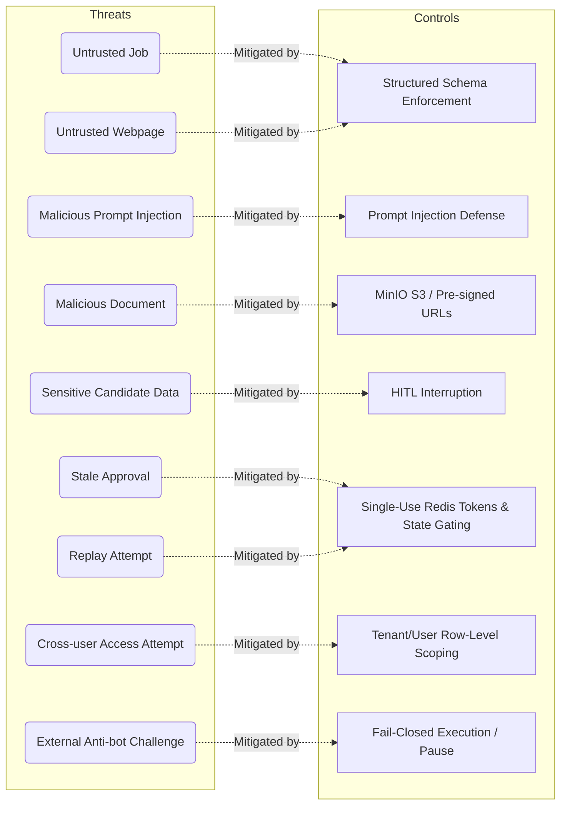

# Security Architecture & Threat Model

## Security Architecture

*Note: The security architecture includes protections for SSRF, DNS rebinding, browser context isolation, memory provenance/trust verification, replay protection, stale approval protection, fail-closed behavior, and complete auditability.*

## Threat Model

