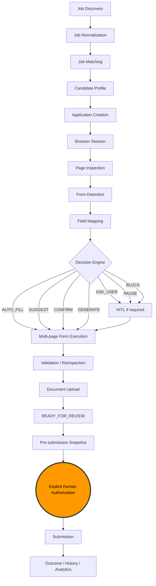

# Golden Application Workflow

```mermaid
flowchart TD
    Discover[Job Discovery] --> Normalize[Job Normalization]
    Normalize --> Match[Job Matching]
    Match --> Profile[Candidate Profile]
    Profile --> CreateApp[Application Creation]
    CreateApp --> BrowserSession[Browser Session]
    BrowserSession --> Inspect[Page Inspection]
    Inspect --> FormDetect[Form Detection]
    FormDetect --> FieldMap[Field Mapping]
    FieldMap --> Engine{Decision Engine}
    
    Engine -->|AUTO_FILL| Exec[Multi-page Form Execution]
    Engine -->|SUGGEST| Exec
    Engine -->|CONFIRM| Exec
    Engine -->|GENERATE| Exec
    
    Engine -->|ASK_USER| HITL[HITL if required]
    Engine -->|PAUSE| HITL
    Engine -->|BLOCK| HITL
    
    HITL --> Exec
    
    Exec --> Validate[Validation / Reinspection]
    Validate --> Upload[Document Upload]
    Upload --> Review[READY_FOR_REVIEW]
    Review --> Snapshot[Pre-submission Snapshot]
    
    Snapshot --> Boundary((Explicit Human Authorization))
    Boundary --> Submit[Submission]
    Submit --> Outcome[Outcome / History / Analytics]
    
    style Boundary fill:#ff9900,stroke:#333,stroke-width:4px,color:#000
```
